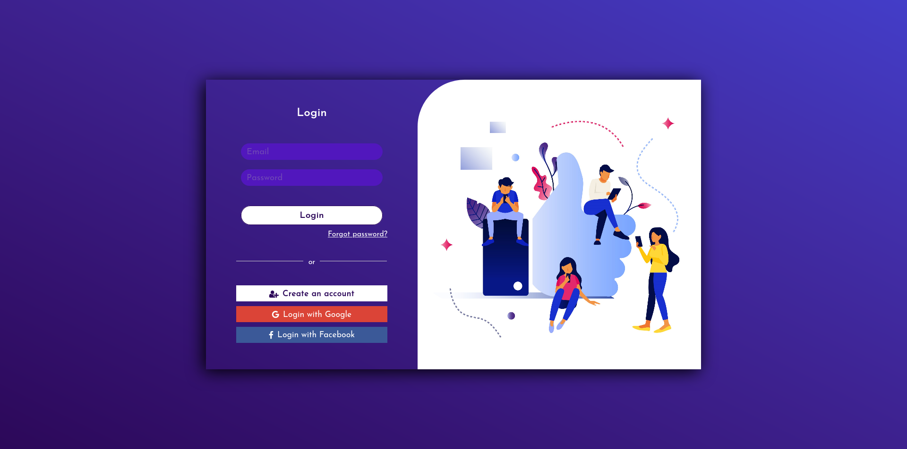

## Login boiler plate with full working register, activation, reset and forgot password, facebook and google login functionality



## Simple Installation Guide

***

### Install dependencies for backend and frontend
```
#backend
npm i

#frontend
cd client
npm i
```

---

### Create .env file in root folder

In the .env file add the following:

**CLIENT_URL** e.g. http://localhost:3000

**MONGO_URI** connect to yout own Mongo Database

**JWT_ACCOUNT_ACTIVATION** any kind of text

**JWT_SECRET** any kind of text

**JWT_RESET_PASSWORD** any kind of text

**EMAIL_FROM** email from which you will send emails for activating user account, reset password and frogot password

**EMAIL_PASSWORD** password of that email

>_Optional_: 
**GOOGLE_CLIENT** in order to allow users to easily login in through their gmail account [Setup google_oath2_client](https://support.google.com/cloud/answer/6158849?hl=en)

---

### Create .env file in client folder

In the .env file add the following:
>_Optional (if you want google and facebook login)_

**GOOGLE_CLIENT** same as from before

**FACEBOOK_CLIENT** [Setup facebook web app](https://developers.facebook.com/docs/development/create-an-app)